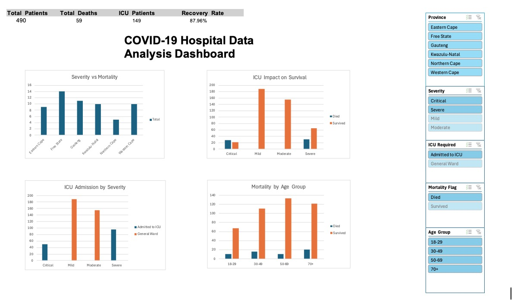

# COVID-19 Hospital Data Analysis

## Project Overview
This project focuses on analysing COVID-19 hospital patient data using Microsoft Excel. The aim was to identify trends, patterns and relationships within the dataset to support data-driven insights.

---

## Tools Used
- Microsoft Excel  
- Pivot Tables  
- Charts & Dashboards  
- Data Cleaning Techniques  
- Conditional Formatting  

---

## Key Features
- Cleaned and structured raw patient data  
- Analysed variables such as age, severity, oxygen levels, ICU admission and comorbidities  
- Created Pivot Tables to summarise and explore the data  
- Designed charts and a dashboard to visualise trends and patterns  

---

##  Screenshots

### Dashboard

---

## Key Insights
- Patients with severe and critical conditions had higher ICU admission rates  
- Comorbidities such as diabetes and heart disease influenced patient outcomes  
- Differences in recovery rates were observed across provinces  
- Lower oxygen levels were associated with more critical cases  

---

##  Outcome
This project strengthened my ability to clean, analyse and visualise data using Excel. It also improved my understanding of how data can be used to support decision making in real-world scenarios.

---

##  Author
Lerato Letsoele
